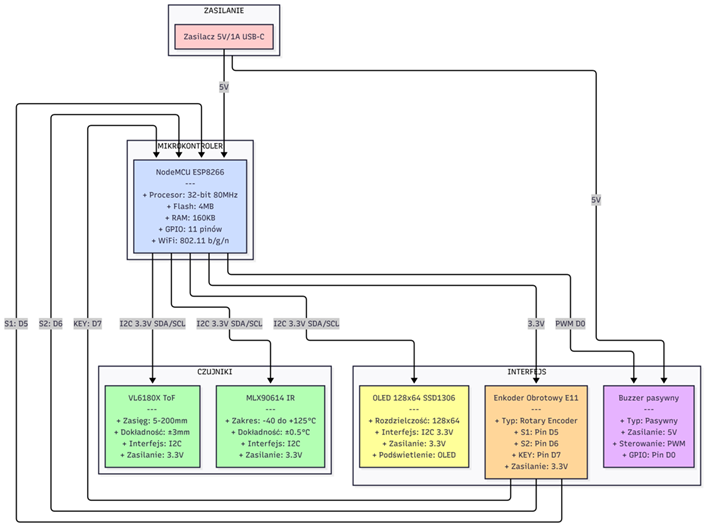

# Smart Coaster — ESP8266 Beverage Temperature Monitor

An embedded system built on the **NodeMCU ESP8266** that detects cup presence, monitors beverage temperature in real time, and alerts the user when the drink has cooled to a configured target temperature.




## Key Features

- Automatic cup detection (VL6180X ToF sensor)
- Non-contact temperature monitoring (MLX90614 IR sensor) with adaptive liquid temperature estimation
- Configurable brew timer and target drinking temperature
- 128×64 OLED display with rotary encoder menu
- Persistent user settings (EEPROM)
- Audible buzzer alerts
- **Mobile Push Notifications** via [ntfy.sh](https://ntfy.sh) (Max priority alarm)
- **Wi-Fi Connectivity** with network state reporting

For a detailed description, refer to the **project report** included in this repository [v1.Raport_Bartosz.Kępa.pdf](v1.Raport_Bartosz.Kępa.pdf).

## Pin Assignment

| Function | NodeMCU Pin | GPIO |
|---|---|---|
| I2C SDA | D2 | GPIO4 |
| I2C SCL | D1 | GPIO5 |
| Encoder S1 | D5 | GPIO14 |
| Encoder S2 | D6 | GPIO12 |
| Encoder Button | D7 | GPIO13 |
| Buzzer | D0 | GPIO16 |

## Build and Flash

Requires [PlatformIO](https://platformio.org/install/ide). All library dependencies are resolved automatically.

```bash
pio run              # compile
pio run -t upload    # flash to board
pio device monitor   # serial monitor (9600 baud)
```

